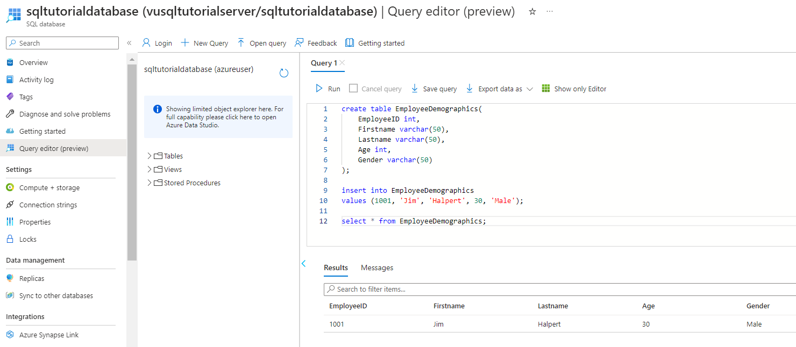
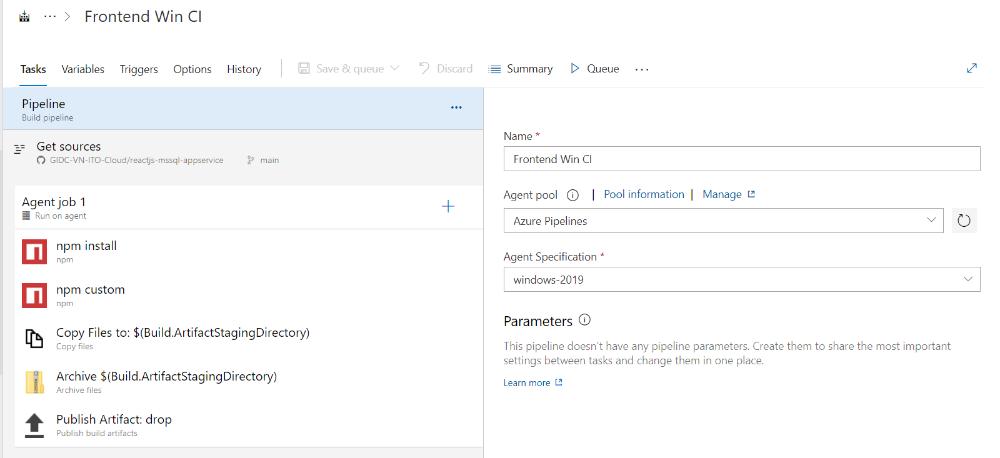

# Create ReactJS - NodeJS server - App Service Azure


## Table of Contents
- [Create ReactJS - NodeJS server - App Service Azure](#create-reactjs---nodejs-server---app-service-azure)
  - [Table of Contents](#table-of-contents)
  - [About The Project](#about-the-project)
  - [Technologies Used](#technologies-used)
  - [Prerequisites](#prerequisites)
    - [Create MS SQL Database](#create-ms-sql-database)
    - [Run Express Server](#run-express-server)
    - [Run ReactJS](#run-reactjs)
    - [Create Azure SQL Database](#create-azure-sql-database)
    - [Create Linux Azure App Service for Express Server](#create-linux-azure-app-service-for-express-server)
    - [Create Windows Azure App Service for ReactJS](#create-windows-azure-app-service-for-reactjs)
  - [Project Status](#project-status)
  - [Room for Improvement](#room-for-improvement)
  - [Acknowledgements](#acknowledgements)
  - [Contact](#contact)

<!-- * [License](#license) -->

## About The Project
- Create simple reactjs - express - mssql application on local and cloud enviroment
- About the cloud, I use:
    - Linux Azure App Service for reactjs frontend
    - Windows Azrure App Service for express backend
    - Azure SQL Database
    - Azure DevOps for CI/CD Application

## Technologies Used
- ReactJS - Express - MSSQL - NodeJS
- Azure App Service
- Azure SQL Database (MSSQL)
- Azure DevOps

## Prerequisites
- Local NodeJS and MSSQL for testing.
- Microsoft Azure Account – for accessing Azure Portal and hosting your application. If you don’t have an account yet, you can create one for free using this link.
- Azure DevOps Account – for storing the source code and implementing build and release pipelines. Azure DevOps is free to use and if you don’t have an account yet, you can create one using this [link](https://azure.microsoft.com/en-us/services/devops/).

### Create MS SQL Database
- Create Database
    ```sql
    create table EmployeeDemographics(
        EmployeeID int,
        Firstname varchar(50),
        Lastname varchar(50),
        Age int,
        Gender varchar(50)
    );

    insert into EmployeeDemographics
    values (1001, 'Jim', 'Halpert', 30, 'Male');
    ```

- Result:

    

- Ensure TCP/IP Enabled:

    

### Run Express Server
- Clone the repo
    ```sh
    git clone https://github.com/your_username_/Project-Name.git
    ```
- Config ./backend/dbconfig.js

    

- Run the server

    Run Terminal at backend folder and run command:
    ```ps
    npm install
    npm run server
    ```
- Expect result
    

### Run ReactJS
- Config proxy server
    
    ./frontend/package.json
    ```json
    "proxy": "http://localhost:5000"
    ```

    ./frontend/src/App.js
    ```js
    const API_URL = 'http://localhost:5000';
    ```

- Run the server

    Run Terminal at frontend folder and run command:
    ```ps
    npm install
    npm run start
    ```
- Expect result
    Input Jim on Firstame and Click:

    

### Create Azure SQL Database
- Create Azure SQL Database Server

    

- Config Public Access SQL Server. Add your IP Adress

    

- Create Azure SQL Database

    
    
    

    
    
    

- Test with local express server, modify ./backend/dbconfig.js

    

    At backend folder, run:
    ```ps
    npm run server
    ```

- Expect result

    

### Create Linux Azure App Service for Express Server
- Create Linux App Service Plan

    

- Create Web App Service

    

- Modify ./backend/dbconfig.js (have done before)

- Build Azure DevOps Pipeline
  - Create new Project, go to https://dev.azure.com
    
    
  
  - Create Service Connection:
    - Azure Service Principal: [Tutorial to create Service Principal](https://developer.hashicorp.com/terraform/tutorials/azure-get-started/azure-build)

    - GitHub PAT

        
    
    

    

    
    
  - Create Backend CI pipeline
    - Create new pipeline
    - Chose Use the classic editor
        
    - Chose your GitHub Source
        
    - Chose your Empty job
        
    - Edit pipeline
        
        
        
        

  - Create Backend CD pipeline
    - Chose your Empty job
        
    - Edit pipeline
        
        
        
        
- Expect result
    - Run CI and CD pipeline
        
        
    

### Create Windows Azure App Service for ReactJS
- Create Windows App Service Plan

    

- Create App Service

    

- Config proxy server
    
    ./frontend/package.json
    ```json
    "proxy": "https://linuxappservice11.azurewebsites.net"
    ```

    ./frontend/src/App.js
    ```js
    const API_URL = 'https://linuxappservice11.azurewebsites.net';
    ```

- Build Azure DevOps Pipeline
  - Create Frontend CI pipeline
    - Edit pipeline
        
        
        
        
        
        
  - Create Frontend CD pipeline
        
        
        
        
        

- Expect result
    - Run CI and CD pipeline
        

## Project Status
   - Project is: _in progress_

## Room for Improvement
- Use Terraform for automatic deployment
- Add private endpoint for more security

## Acknowledgements
- The reactjs, nodejs server and sql database was based on [Coding with Kevin][Kevin]
- The Azure DevOps Pipeline was inspired by [Code On Cloud][codeoncloud]
- [Badges](https://github.com/Ileriayo/markdown-badges)

## Contact
Created by [@vunguyen22271](https://github.com/vunguyen22271) - feel free to contact me!

[Kevin]: https://www.youtube.com/watch?v=Uh2JCSUjA_E
[codeoncloud]: https://www.youtube.com/watch?v=9JPga11NGUE
